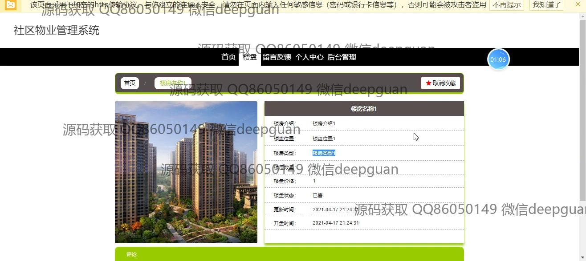
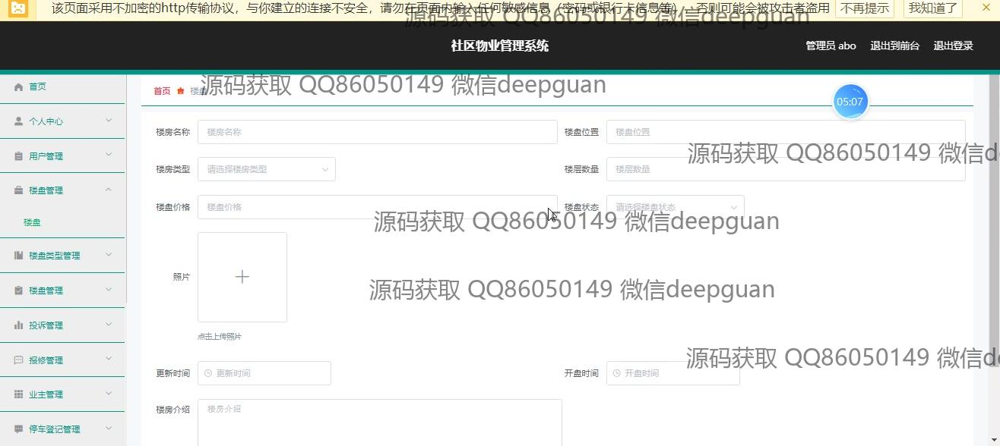
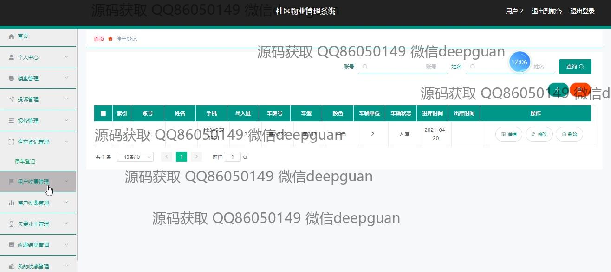

<h1 align="center">基于SSM的社区物业管理系统+vue</h1>

## 简介
社区物业管理系统：角色分为管理员和普通用户；功能包括用户管理、楼盘管理、投诉管理、报修管理、停车登记管理、收费管理和个人中心。    --计算机毕业设计源码；毕设源码；java毕业设计源码

## 联系方式

<h3 align="center">获取完整代码与数据库文件 + 微信：deepguan QQ: 86050149 QQ群: 783742310</h3>

<h3 align="center">可帮忙远程部署 包运行成功！提供远程部署、修改代码、设计文档指导、代码讲解等服务！</h3>

## 功能介绍（完整见运行截图）
管理员： 管理员可以通过登录界面进入系统，访问主要功能模块，包括用户管理、投诉管理、停车登记管理、楼盘管理和费用收缴管理等。管理员可以查看和编辑业主和租户的信息，管理社区内的楼盘及其详细信息，处理用户的投诉和报修请求。同时，管理员具备权限进行角色设定和修改系统参数，确保系统的正常运作。导航菜单支持快速切换不同模块，管理员也可以通过搜索功能进行快速查询。界面设计简洁，提供直观的操作体验和便捷的管理功能。

普通用户： 普通用户可以通过注册界面创建账户，并使用登录页面进入系统。用户可以访问个人中心查看和更新个人信息，包括账户信息、联系方式和头像等。在系统中，用户可以浏览并管理楼盘信息，通过点击进入详细页面查看更多信息，如位置、价格和更新时间。用户还可以在投诉管理模块提交和查看自己提交的投诉详细信息，确保问题及时得到解决。系统提供查询、编辑和删除等功能，便于用户进行个性化管理。整体界面设计清晰易用，优化了用户体验。

## 运行截图

本代码来源于网络,仅供学习参考使用!

